# FastAPI Microservices on AWS - Architecture Documentation

## Table of Contents
1. [Architecture Overview](#architecture-overview)
2. [AWS Infrastructure Integration](#aws-infrastructure-integration)
3. [Service Integration Patterns](#service-integration-patterns)
4. [Network Architecture](#network-architecture)
5. [Security Model](#security-model)
6. [Data Flow Patterns](#data-flow-patterns)
7. [High Availability & Scaling](#high-availability--scaling)
8. [Cost Optimization Strategy](#cost-optimization-strategy)
9. [Regional Deployment (SEA)](#regional-deployment-sea)

---

## Architecture Overview

Our FastAPI microservices solution is built on AWS cloud infrastructure, designed for high availability, scalability, and cost efficiency in the Southeast Asia region. The architecture follows cloud-native principles with containerized applications, managed databases, and automated scaling capabilities.

### High-Level Architecture

```mermaid
graph TB
    %% External Layer
    Users["`👥 **Users**<br/>SEA Region Clients`"]
    
    %% AWS Cloud
    subgraph AWS["🌐 AWS Cloud - Singapore (ap-southeast-1)"]
        %% Edge Layer
        subgraph Edge["📡 Edge & Load Balancing"]
            ALB["`🔄 **Application Load Balancer**<br/>- Internet-facing<br/>- Health checks<br/>- SSL termination`"]
        end
        
        %% EKS Cluster
        subgraph EKS["☸️ Amazon EKS Cluster"]
            subgraph Nodes["🖥️ Worker Nodes (t3.medium)"]
                subgraph Namespace["📦 fastapi-microservices namespace"]
                    API["`🚀 **FastAPI App Pods**<br/>- 3 replicas<br/>- Auto-scaling<br/>- Health probes`"]
                    Worker["`👷 **Background Workers**<br/>- 2 replicas<br/>- ARQ task processing<br/>- Auto-scaling`"]
                end
                
                subgraph System["🔧 System Pods"]
                    LBC["`⚖️ **AWS Load Balancer Controller**<br/>- Manages ALB<br/>- Target group health`"]
                    CW["`📊 **CloudWatch Agent**<br/>- Metrics collection<br/>- Log aggregation`"]
                end
            end
        end
        
        %% Data Layer
        subgraph Data["🗄️ Data & Cache Layer"]
            RDS["`🐘 **RDS PostgreSQL**<br/>- Multi-AZ deployment<br/>- Encrypted storage<br/>- Automated backups`"]
            Redis["`📝 **ElastiCache Redis**<br/>- In-memory caching<br/>- Task queue<br/>- Session storage`"]
        end
        
        %% Container Registry
        ECR["`📦 **Amazon ECR**<br/>- Private repositories<br/>- Image scanning<br/>- Lifecycle policies`"]
        
        %% Security & Management
        subgraph Security["🔐 Security & Identity"]
            IAM["`👤 **IAM Roles**<br/>- EKS service roles<br/>- Pod permissions<br/>- Least privilege`"]
            SM["`🔑 **Secrets Manager**<br/>- Database passwords<br/>- JWT secrets<br/>- Encrypted storage`"]
        end
        
        %% Networking
        subgraph Network["🌐 VPC Networking"]
            VPC["`🏠 **VPC (10.0.0.0/16)**<br/>- Multi-AZ subnets<br/>- Private/Public separation<br/>- Security groups`"]
        end
        
        %% Monitoring
        subgraph Monitoring["📈 Monitoring & Logging"]
            CloudWatch["`📊 **CloudWatch**<br/>- Container Insights<br/>- Application metrics<br/>- Log aggregation`"]
        end
    end
    
    %% Data Flow Connections
    Users -->|HTTPS requests| ALB
    ALB -->|HTTP traffic| API
    API -->|Database queries| RDS
    API -->|Cache operations| Redis
    Worker -->|Task processing| Redis
    Worker -->|Database updates| RDS
    API -.->|Async tasks| Worker
    
    %% Management Connections
    ECR -.->|Pull images| API
    ECR -.->|Pull images| Worker
    LBC -.->|Manages| ALB
    SM -.->|Provides secrets| API
    SM -.->|Provides secrets| Worker
    CW -.->|Collects metrics| CloudWatch
    
    %% Infrastructure Connections
    EKS -.->|Deployed in| VPC
    RDS -.->|Deployed in| VPC
    Redis -.->|Deployed in| VPC
    IAM -.->|Secures| EKS
    IAM -.->|Secures| RDS
    IAM -.->|Secures| Redis
    
    %% Styling
    classDef awsService fill:#FF9900,stroke:#333,stroke-width:2px,color:white
    classDef dataService fill:#1f77b4,stroke:#333,stroke-width:2px,color:white
    classDef appService fill:#2ca02c,stroke:#333,stroke-width:2px,color:white
    classDef securityService fill:#d62728,stroke:#333,stroke-width:2px,color:white
    classDef userService fill:#9467bd,stroke:#333,stroke-width:2px,color:white
    
    class ALB,ECR,VPC,CloudWatch awsService
    class RDS,Redis dataService
    class API,Worker,LBC,CW appService
    class IAM,SM securityService
    class Users userService
```



---

## AWS Infrastructure Integration

### 1. **Container Orchestration with Amazon EKS**

**How We Use It:**
- **Managed Kubernetes Control Plane**: AWS handles the Kubernetes masters, providing high availability and automatic updates
- **Worker Node Management**: EC2 instances are automatically provisioned and managed through EKS managed node groups
- **Service Integration**: Native integration with AWS services like ALB, ECR, and CloudWatch

**Integration Pattern:**
```yaml
# EKS seamlessly integrates with other AWS services
EKS Cluster → IAM OIDC Provider → Service Accounts → AWS Services
            → VPC Subnets → Security Groups → RDS/ElastiCache
            → ECR Integration → Automatic Image Pulls
```

**Why This Approach:**
- **Zero-downtime deployments** with rolling updates
- **Auto-scaling** based on CPU/memory usage
- **Multi-AZ deployment** for high availability
- **Cost optimization** through spot instances and right-sizing

### 2. **Database Layer with Amazon RDS PostgreSQL**

**How We Use It:**
- **Multi-AZ Deployment**: Primary database in AZ-1a with synchronous standby in AZ-1b
- **Automated Backups**: 7-day retention with point-in-time recovery
- **Connection Pooling**: Application-level pooling through SQLAlchemy
- **Security**: Encrypted at rest and in transit, isolated in private subnets

**Integration Pattern:**
```
FastAPI Pods → Database Connection Pool → RDS Primary (AZ-1a)
                                      ↓ (Synchronous Replication)
                                   RDS Standby (AZ-1b)
```

**Database Integration Features:**
- **Kubernetes Service Discovery**: Using `ExternalName` service type to abstract RDS endpoint
- **Secret Management**: Database credentials stored in AWS Secrets Manager and injected as Kubernetes secrets
- **Health Monitoring**: Application health checks verify database connectivity

### 3. **Caching and Task Queue with ElastiCache Redis**

**How We Use It:**
- **Session Storage**: User sessions and authentication tokens
- **Application Caching**: Frequently accessed data to reduce database load
- **Background Task Queue**: ARQ (Async Redis Queue) for email sending and data processing
- **Rate Limiting**: API rate limiting and throttling

**Integration Pattern:**
```
FastAPI Pods → Redis Client → ElastiCache Redis → Background Workers
            ↓                                   ↑
         Cache Layer                     Task Processing
```

**Redis Integration Benefits:**
- **Low Latency**: Sub-millisecond response times for cache operations
- **Persistence**: Configurable persistence for important queue data
- **Clustering Ready**: Easy migration to Redis Cluster for larger workloads

### 4. **Container Registry with Amazon ECR**

**How We Use It:**
- **Private Repositories**: Secure storage for FastAPI and worker container images
- **Image Scanning**: Automated vulnerability scanning on image push
- **Lifecycle Policies**: Automatic cleanup of old image versions
- **Cross-Region Replication**: Ready for multi-region deployments

**CI/CD Integration:**
```
GitHub Actions → Build Images → Push to ECR → EKS Auto-Deploy
               ↓
            Image Scanning → Security Validation → Production Deployment
```

### 5. **Load Balancing with Application Load Balancer**

**How We Use It:**
- **Internet-Facing**: Single entry point for all external traffic
- **Health Checks**: Continuous monitoring of pod health via `/api/health/` endpoint
- **SSL Termination**: HTTPS certificate management through ACM
- **Path-Based Routing**: Future capability for multiple services

**ALB Integration with EKS:**
```
AWS Load Balancer Controller → Kubernetes Ingress → ALB Creation
                            ↓
                    Target Group Management → Pod IP Registration
```

---

## Service Integration Patterns

### Seamless Integration Features

**1. Service Discovery and DNS**
```yaml
# Kubernetes DNS automatically resolves service names
postgres-service.fastapi-microservices.svc.cluster.local → RDS Endpoint
redis-service.fastapi-microservices.svc.cluster.local → ElastiCache Endpoint
```

**2. Secret Management Integration**
```yaml
# Secrets flow from AWS to Kubernetes to Pods
AWS Secrets Manager → Kubernetes Secret → Environment Variable → Application
```

**3. Auto-scaling Integration**
```yaml
# Multiple layers of scaling
HPA (Horizontal Pod Autoscaler) → Pod Scaling
Cluster Autoscaler → Node Scaling  
RDS → Read Replicas (when needed)
```

**4. Health Check Integration**
```yaml
# Health checks at every layer
ALB Target Group → Kubernetes Service → Pod Health Probe → Application Health
```

---

## Network Architecture

### VPC and Multi-AZ Design

### Network Integration Benefits

**1. Multi-AZ High Availability**
- **Application Layer**: EKS nodes spread across AZ-1a and AZ-1b
- **Database Layer**: RDS Primary in AZ-1a with standby in AZ-1b
- **Load Balancer**: ALB spans all three AZs for maximum availability

**2. Security Through Network Isolation**
- **Public Subnets**: Only ALB and NAT Gateways have internet access
- **Private Subnets**: All application and data components isolated from internet
- **Security Groups**: Granular traffic control between service layers

**3. Outbound Internet Access**
- **NAT Gateways**: Enable private subnets to access internet for updates and external APIs
- **ECR Access**: Worker nodes can pull container images through NAT gateways
- **Cost Optimization**: NAT gateways only in AZ-1a and AZ-1b to reduce costs

---

## Security Model

### Multi-Layer Security Architecture

**1. Identity and Access Management (IAM)**
```yaml
EKS Service Role:
  - Cluster management permissions
  - CloudWatch logging access
  - ECR read access

Node Group Role:
  - EC2 instance permissions
  - EKS worker node policies
  - Container registry access

Pod Service Accounts:
  - Scoped permissions per service
  - AWS service access via OIDC
  - Principle of least privilege
```

**2. Network Security**
```yaml
Security Group Rules:
  ALB Security Group:
    - Inbound: HTTP (80), HTTPS (443) from 0.0.0.0/0
    - Outbound: HTTP (80) to EKS nodes
  
  EKS Security Group:
    - Inbound: HTTP (80) from ALB
    - Inbound: All traffic from same security group
    - Outbound: All traffic (for internet access via NAT)
  
  RDS Security Group:
    - Inbound: PostgreSQL (5432) from EKS security group only
    - Outbound: None
  
  Redis Security Group:
    - Inbound: Redis (6379) from EKS security group only
    - Outbound: None
```

**3. Data Encryption**
```yaml
Encryption at Rest:
  - RDS: AES-256 encryption using AWS KMS
  - EBS Volumes: Encrypted by default
  - Secrets Manager: Encrypted with AWS KMS

Encryption in Transit:
  - ALB to Client: TLS 1.2+ (HTTPS)
  - ALB to Pods: HTTP (internal network)
  - Pods to RDS: SSL/TLS connection
  - Pods to Redis: TLS connection (optional)
```

**4. Secret Management**
```yaml
AWS Secrets Manager → Kubernetes Secrets → Pod Environment Variables

Secrets Stored:
  - Database passwords
  - JWT signing keys
  - API keys for external services
  - Session encryption keys
```

---

## Data Flow Patterns

### 1. **Synchronous Request Processing**
```
User Request → ALB → Kubernetes Service → FastAPI Pod → Response
                                      ↓
                               Cache Check (Redis)
                                      ↓
                               Database Query (RDS)
```

### 2. **Asynchronous Task Processing**
```
FastAPI Endpoint → Enqueue Task (Redis) → Background Worker → Database Update
                ↓                                           ↓
           Return Task ID                              Notification/Email
```

### 3. **Caching Strategy**
```
Read Request → Check Redis Cache → Cache Hit: Return Data
                               → Cache Miss: Query RDS → Update Cache → Return Data
```

### 4. **Session Management**
```
User Login → Generate JWT → Store Session (Redis) → Return Token
Request → Validate JWT → Check Session (Redis) → Process Request
```

---

## High Availability & Scaling

### Horizontal Scaling Configuration

**1. Application Auto-scaling**
```yaml
Horizontal Pod Autoscaler (HPA):
  - Target CPU: 70%
  - Target Memory: 80%
  - Min Replicas: 2
  - Max Replicas: 10
  - Scale-up: 60 seconds
  - Scale-down: 300 seconds
```

**2. Infrastructure Auto-scaling**
```yaml
Cluster Autoscaler:
  - Monitors pod scheduling failures
  - Automatically adds/removes nodes
  - Respects node group min/max settings
  - Cost-optimized instance selection
```

**3. Database Scaling Strategy**
```yaml
Current: Single RDS instance with Multi-AZ
Future Options:
  - Read Replicas for read-heavy workloads
  - Connection pooling optimization
  - Database sharding for massive scale
```

### High Availability Features

**1. Multi-AZ Deployment**
- **EKS Nodes**: Distributed across multiple AZs
- **RDS**: Primary/Standby configuration with automatic failover
- **ALB**: Cross-AZ load balancing

**2. Health Monitoring**
```yaml
Health Check Layers:
  1. ALB Target Group Health Checks
  2. Kubernetes Liveness Probes
  3. Kubernetes Readiness Probes
  4. Application-level Health Endpoints
```

**3. Disaster Recovery**
```yaml
RTO (Recovery Time Objective): < 5 minutes
RPO (Recovery Point Objective): < 1 minute

Mechanisms:
  - RDS automated backups (7 days)
  - Point-in-time recovery
  - Infrastructure as Code (quick rebuild)
  - Container images in ECR (persistent)
```

---

## Cost Optimization Strategy

### Current Cost Breakdown (Monthly)

| Service | Instance Type | Cost (USD) | Optimization Opportunity |
|---------|---------------|------------|--------------------------|
| EKS Cluster | - | $73 | None (managed service) |
| EC2 Nodes | 2x t3.medium | $60 | Spot instances (-70%) |
| RDS PostgreSQL | db.t3.micro | $15 | Reserved instances (-30%) |
| ElastiCache Redis | cache.t3.micro | $12 | Reserved instances (-30%) |
| Application Load Balancer | - | $18 | None (usage-based) |
| NAT Gateways | 2x instances | $45 | Single NAT for dev (-50%) |
| **Total** | | **$223** | **Potential: $134** |

### Cost Optimization Techniques

**1. Development Environment Optimization**
```bash
# Use smaller instances for development
RDS: db.t3.nano ($8/month vs $15/month)
ElastiCache: cache.t2.nano ($6/month vs $12/month)
EC2: t3.small ($30/month vs $60/month)
Single NAT Gateway: $22.5/month vs $45/month
```

**2. Production Cost Management**
```bash
# Reserved Instances (1-year term)
RDS Reserved: $10.5/month (30% savings)
ElastiCache Reserved: $8.4/month (30% savings)

# Spot Instances for non-critical workloads
Worker Nodes Spot: $18/month (70% savings)
```

**3. Automatic Cost Controls**
```bash
# Implement automatic shutdown/startup
Weekend Shutdown: Save $1,600/year
Off-hours Scaling: Auto-scale to min replicas
```

### Regional Cost Considerations (Singapore)

**Singapore vs US East Pricing Comparison:**
- **Compute**: +15% premium in Singapore
- **Storage**: +10% premium in Singapore
- **Data Transfer**: 60% savings for SEA users
- **Latency Benefits**: <20ms vs 200-300ms

**Business Justification:**
- **User Experience**: 10x faster response times
- **Compliance**: Data residency requirements
- **Market Access**: Local presence for SEA expansion

---

## Regional Deployment (SEA)

### Singapore Region Benefits

**1. Latency Optimization**
```
Singapore to SEA Countries:
- Malaysia: 5-15ms
- Indonesia: 10-25ms
- Thailand: 15-30ms
- Philippines: 20-40ms
- Vietnam: 25-50ms

Compare to US East (Virginia):
- SEA Countries: 200-300ms
```

**2. Compliance and Data Residency**
```yaml
Compliance Standards:
  - Singapore PDPA (Personal Data Protection Act)
  - GDPR adequacy decision
  - MAS (Monetary Authority) guidelines
  - SOC 1, 2, 3 compliance
  - ISO 27001, 27017, 27018

Data Residency Features:
  - All data stays within Singapore
  - No cross-border data transfer
  - Local backup and recovery
  - Audit trail for compliance
```

**3. Business Continuity**
```yaml
Singapore Infrastructure:
  - 3 Availability Zones
  - 99.99% SLA for Multi-AZ deployments
  - Local AWS support (Singapore time zone)
  - Disaster recovery within region
```

### Scaling for SEA Market

**1. Multi-Country Expansion**
```yaml
Future Architecture:
  Primary: Singapore (ap-southeast-1)
  Secondary: Sydney (ap-southeast-2) for Australia/NZ
  Tertiary: Jakarta (ap-southeast-3) for Indonesia-specific needs

Cross-Region Features:
  - CloudFront for static content
  - Route 53 for DNS failover
  - Cross-region database replication
```

**2. Localization Support**
```yaml
Application Features:
  - Multi-language support (English, Bahasa, Thai, etc.)
  - Local currency handling
  - Time zone management
  - Cultural customization
```

---

## Monitoring and Observability

### CloudWatch Integration

**1. Container Insights**
```yaml
Metrics Collected:
  - CPU and memory utilization
  - Network I/O
  - Disk I/O
  - Pod-level metrics
  - Node-level metrics
```

**2. Application Metrics**
```yaml
Custom Metrics:
  - API response times
  - Database connection pool usage
  - Redis cache hit/miss ratios
  - Background task processing rates
  - User authentication rates
```

**3. Log Aggregation**
```yaml
Log Sources:
  - EKS control plane logs
  - Application logs (FastAPI)
  - Worker process logs
  - Database performance logs
  - Load balancer access logs
```

### Alerting Strategy

**1. Infrastructure Alerts**
```yaml
Critical Alerts:
  - EKS node failure
  - RDS connection failures
  - High CPU/memory usage (>80%)
  - Disk space usage (>85%)
```

**2. Application Alerts**
```yaml
Business Alerts:
  - API error rate >5%
  - Response time >500ms
  - Background task failures
  - Authentication failures
```

---

## Deployment and CI/CD Integration

### GitOps Workflow

```yaml
Git Push → GitHub Actions → Build Images → ECR Push → EKS Deploy
        ↓
    Automated Testing → Security Scanning → Production Approval
```

### Blue-Green Deployment Strategy

```yaml
Current Architecture Support:
  - Rolling updates with zero downtime
  - Canary deployments through ingress weights
  - Database migration strategies
  - Rollback capabilities
```

---

## Future Architecture Enhancements

### Scalability Roadmap

**1. Microservices Expansion**
```yaml
Current: Monolithic FastAPI application
Future: Service decomposition
  - User Service
  - Authentication Service  
  - Notification Service
  - Analytics Service
```

**2. Advanced Data Solutions**
```yaml
Current: Single PostgreSQL instance
Future Options:
  - Read replicas for scaling
  - Data warehousing with Redshift
  - Real-time analytics with Kinesis
  - Document storage with DynamoDB
```

**3. Enhanced Security**
```yaml
Current: Basic IAM and security groups
Future Enhancements:
  - Service mesh (Istio)
  - Advanced threat detection
  - Zero-trust networking
  - Certificate management automation
```

### Technology Evolution

**1. Serverless Integration**
```yaml
Potential Migration Path:
  - AWS Lambda for background tasks
  - API Gateway for edge routing
  - DynamoDB for session storage
  - S3 for static content
```

**2. Machine Learning Integration**
```yaml
ML/AI Capabilities:
  - SageMaker for model training
  - Personalization service
  - Anomaly detection
  - Predictive scaling
```

---

## Conclusion

This FastAPI microservices architecture on AWS demonstrates a comprehensive cloud-native solution that leverages multiple AWS services in an integrated, seamless manner. The architecture provides:

✅ **High Availability**: Multi-AZ deployment with automatic failover  
✅ **Scalability**: Auto-scaling at application and infrastructure levels  
✅ **Security**: Multi-layer security with encryption and access controls  
✅ **Cost Efficiency**: Optimized for the Singapore region with cost controls  
✅ **Developer Experience**: CI/CD integration with GitOps workflows  
✅ **Monitoring**: Comprehensive observability with CloudWatch  
✅ **Compliance**: Data residency and regulatory compliance for SEA  

The integration between services creates a seamless experience where each AWS service enhances the others, resulting in a robust, production-ready platform that can scale with business growth in the Southeast Asian market. 